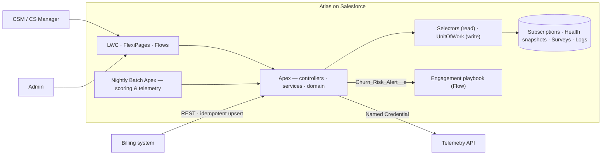

# Atlas Customer Success Cloud

> A native Salesforce Customer Success platform: subscriptions, health scoring, NPS, churn-risk
> engagement and the renewal pipeline.

[](sfdx-project.json)
[](docs/ARCHITECTURE.md)
[](force-app/main/default/lwc)
[](.prettierrc)
[](pmd/ruleset.xml)
[](LICENSE)

<!-- Add the live CI badge once this repo is on GitHub (replace OWNER/REPO):
[](../../actions/workflows/ci.yml)
-->

Atlas manages the post-sale customer lifecycle on Salesforce for a B2B SaaS vendor: the billing
system pushes subscriptions in over REST, a telemetry API supplies product usage, a nightly
engine scores each customer's health across four weighted dimensions, and an account crossing
into high churn risk raises an event that starts the CSM playbook.

The design keeps work on the platform rather than beside it. Renewals are Opportunity record
types, not a custom object, so forecasting and pipeline reporting keep working. Reads go through
selectors in user mode and writes through a Unit of Work, so sharing and FLS are enforced in one
place. The scoring dimensions are metadata-driven strategies, so re-weighting is configuration
rather than a deployment. The reasoning behind each of these is in the [ADRs](docs/adr).



**Jump to:** [What's here](#whats-here) · [Repository layout](#repository-layout) ·
[Getting started](#getting-started) · [Design decisions](#key-design-decisions) ·
[Documentation](#documentation) · [Known limitations](#known-limitations)

## What's here

- **Data model** — `Subscription__c` with a Master-Detail junction to `Product2`
  (`Subscription_Item__c`, ARR roll-up), health snapshots and survey responses as Master-Detail
  children of Account, platform events for churn alerts and logging, weights and windows in
  Custom Metadata.
- **Apex** — layered: triggers route to handlers, handlers call domain (state machine,
  defaulting) and services (renewal sync, scoring, NPS aggregation), all reads go through
  selectors (`WITH USER_MODE` by default), all writes through a small Unit of Work with an
  explicit access level. The health engine is a Strategy: each dimension is one class, wired by
  a Custom Metadata record via `Type.forName`, so re-weighting is a config change and a new
  dimension is one class + one record.
- **Async** — nightly Batch Apex for scoring (with a chained retention purge), Batch + chained
  Queueable with attempt cap for telemetry ingestion, Schedulable entry points.
- **Integration** — inbound idempotent REST upsert for billing (`/atlas/v1/subscriptions`,
  keyed by external id), outbound Named + External Credential for telemetry. Retry only on
  5xx/timeout; 4xx is logged and dropped.
- **UI** — four LWCs. On the Account page (the `Atlas Customer 360` FlexiPage): a health panel
  (score, risk badge, dimension bars, inline SVG trend sparkline, on-demand recalculation) and
  a sortable subscription list, kept in sync through Lightning Message Service. On the
  `CS Command Center` app page: a portfolio dashboard (KPI tiles, churn-risk distribution with
  labeled bars, at-risk triage list with filter + paging) and a renewal workspace
  (30/60/90/180-day horizons, infinite scroll via `lightning-datatable` lazy loading). All
  aggregate queries run as the viewer, so every number respects sharing.
- **Flows, each where Flow is the right tool** — platform-event-triggered churn playbook
  (admin-owned), record-triggered "Renewal won → subscription Renewed" (one keyed cross-object
  update), scheduled NPS coverage sweep (indexed entry criteria only, no per-interview
  queries), and a screen flow for logging NPS collected off-channel.
- **Security** — Private OWD, permission sets + one permission set group, zero grants on
  profiles, user-mode enforcement in Apex with the few system-mode paths enumerated in
  [ADR-0005](docs/adr/ADR-0005-user-mode-by-default.md).
- **Observability** — logging through a publish-immediately platform event so error logs
  survive transaction rollback, persisted to `App_Log__c` by a subscriber trigger.
- **Tests** — Apex tests with a data factory, callout mocks, platform-event delivery, 200-record
  bulk proofs, negative and permission tests (`runAs` with and without the permission sets);
  Jest tests for all four LWCs.
- **Docs** — [architecture reference with Mermaid diagrams](docs/ARCHITECTURE.md), eight
  [ADRs](docs/adr) covering the significant design decisions,
  [security model](docs/SECURITY.md), [API contract](docs/API.md), plus
  [admin](docs/ADMIN_GUIDE.md), [developer](docs/DEVELOPER_GUIDE.md) and
  [operations](docs/OPERATIONS.md) guides.
- **DevOps** — PR pipeline (Prettier, ESLint, Jest, Salesforce Code Analyzer/PMD, scratch-org
  Apex tests when a Dev Hub secret exists) and a tag-driven release pipeline with a
  check-only validation before the production deploy.

## Repository layout

```text
atlas-customer-success-cloud/
├── force-app/main/default/
│   ├── classes/
│   │   ├── api/           # AtlasSubscriptionRestApi — inbound billing REST
│   │   ├── controllers/   # @AuraEnabled read models for the LWCs
│   │   ├── domain/        # subscription state machine + health-dimension strategies
│   │   ├── framework/     # AtlasTriggerHandler · UnitOfWork · Logger · AtlasSettings
│   │   ├── integration/   # TelemetryClient + batch/queueable ingestion
│   │   ├── selectors/     # every SOQL read, one class per object
│   │   ├── services/      # orchestration: scoring, renewals, NPS, billing sync
│   │   └── tests/         # Apex tests + AtlasTestDataFactory
│   ├── lwc/               # healthScorePanel · subscriptionList · portfolioDashboard · renewalWorkspace
│   ├── flows/             # event- / record- / schedule-triggered + screen flows
│   ├── objects/           # custom objects, fields, platform events, Custom Metadata types
│   ├── customMetadata/    # Health_Dimension + Atlas_Setting records (tunables, no deploy)
│   ├── permissionsets/    # Atlas_CS_Base · Atlas_CSM · Atlas_Integration (+ PSG, sharing rules)
│   └── flexipages/ · tabs/ · applications/   # Lightning UI surfaces
├── docs/                  # architecture, security, API contract, guides
│   └── adr/               # 8 architecture decision records
├── pmd/                   # PMD ruleset enforced by Salesforce Code Analyzer in CI
├── config/                # scratch org definition
└── .github/workflows/     # CI (per-PR) and Release (per-tag) pipelines
```

Two rules make the tree navigable: **one selector per object owns every read of it**, and
**every write goes through `UnitOfWork`** — so "where does this data come from / go to?" always
has one answer.

## Getting started

```bash
npm install

# scratch org
sf org create scratch -f config/project-scratch-def.json -a atlas --set-default
sf project deploy start
# user-mode enforcement is real: even the admin needs the permission sets
sf org assign permset --name Atlas_CS_Base --name Atlas_CSM --name Atlas_Integration
sf apex run test --code-coverage --result-format human --wait 30

# local checks
npm run lint
npm run test:unit
```

Post-deploy (org config, deliberately not in metadata):

```apex
// Schedule the nightly jobs
System.schedule('Atlas Health Scoring', '0 0 2 * * ?', new HealthScoreScheduler());
System.schedule('Atlas Telemetry Ingestion', '0 0 1 * * ?', new TelemetryIngestionScheduler());
```

Assign `Atlas_CS_Base` + `Atlas_CSM` (or the `Atlas_CS_Manager` group) to CS users and
`Atlas_Integration` to the integration user; configure the `Telemetry_Auth` external
credential principal; drop the two LWCs on the Account record page.

## Key design decisions

- **Renewals as Opportunity record types, not a custom object.** Forecasting, pipeline reports
  and territory management all operate on Opportunity; a `Renewal__c` object forks that
  ecosystem ([ADR-0003](docs/adr/ADR-0003-renewals-as-opportunity-record-types.md)).
- **No fflib dependency.** The patterns (selector, UoW, domain, service, trigger handler) are
  implemented in-house in ~5 small framework classes. A DI container for four services is weight
  without value ([ADR-0001](docs/adr/ADR-0001-lean-enterprise-patterns-over-fflib.md)).
- **Scoring in Batch Apex, engagement in Flow.** The math needs aggregate queries, chunking and
  unit tests; the playbook needs tuning by admins. Each tool where it fits
  ([ADR-0004](docs/adr/ADR-0004-health-scoring-in-batch-apex-with-strategy.md)).
- **Dimensions can't query.** The service pre-loads one context per account from aggregate
  SOQL; strategies are pure functions. That keeps each 200-account chunk cheap and the math
  testable without DML.
- **Missing signal renormalizes weights instead of scoring zero.** An account nobody surveyed
  isn't unhealthy, it's unmeasured. The composite averages only the dimensions that have data.

## Documentation

| Document                                   | What it covers                                                                                                                                                                  |
| ------------------------------------------ | ------------------------------------------------------------------------------------------------------------------------------------------------------------------------------- |
| [Architecture](docs/ARCHITECTURE.md)       | Domain model, layered architecture, the health engine, eventing and LDV strategy, with Mermaid diagrams.                                                                        |
| [ADRs](docs/adr)                           | Eight architecture decision records — the "why" behind fflib-free patterns, renewals-as-record-types, user-mode-by-default, idempotent sync, immediate-event logging, and more. |
| [Security](docs/SECURITY.md)               | Sharing model, permission-set design, Apex enforcement, integration security, audit posture.                                                                                    |
| [API](docs/API.md)                         | The inbound billing REST contract: request/response schema, error mapping, idempotency guarantees.                                                                              |
| [Developer Guide](docs/DEVELOPER_GUIDE.md) | How to extend the codebase without breaking the architecture — layer rules, adding a dimension, adding an integration.                                                          |
| [Operations](docs/OPERATIONS.md)           | Runbook for the scheduled jobs, failure modes, replays, and data-migration bypass.                                                                                              |
| [Admin Guide](docs/ADMIN_GUIDE.md)         | Post-deploy configuration an org admin owns: permission-set assignment, job scheduling, credentials, sandbox refresh.                                                           |

## Known limitations

- **The telemetry API contract is invented.** The client, DTO, retry policy and mocks are real,
  but there's no live system behind the named credential — you'd point it at your product
  analytics endpoint and adjust `TelemetryUsageDTO`.
- **Scores are as fresh as the nightly batch.** On-demand recalculation exists per account, but
  there's no streaming/CDC-based incremental scoring. At true LDV scale I'd also consider
  moving snapshot history to a Big Object earlier than the purge window forces the issue.
- **Approval process, role hierarchy and account teams are documented, not versioned** — they
  bind to org-specific users/roles ([SECURITY.md](docs/SECURITY.md) has the runbook). Same for
  scheduling the jobs.
- **Single currency.** ARR fields assume the org's corporate currency; multi-currency would
  need `convertCurrency` in the aggregates and a pass over the roll-up.
- **NPS windowing is calendar-naive.** 180 days is a metadata setting, not a per-segment
  policy; enterprise customers with annual survey cycles would want windows per account tier.
- **No Experience Cloud surface.** Surveys arrive via API/import in this version; a customer
  -facing survey form was out of scope.
- **CI runs Apex tests only when a `DEVHUB_AUTH_URL` secret exists** — lint, Jest and PMD run
  unconditionally, but I didn't want a red pipeline on forks without a Dev Hub.
- **FlexiPage activation is manual.** The Customer 360 page and Command Center tab deploy,
  but org-default assignment and the quick action for the NPS screen flow are clicks in Setup
  (documented in the admin guide) — page assignments are org configuration.
- **The weekly NPS coverage flow will re-create its task weekly** for an account that stays
  unsurveyed; the noise stops as soon as one response lands. Acceptable for v1, and the
  cadence is an admin lever.

## Contributing & license

Contributions follow the layer rules in the [Developer Guide](docs/DEVELOPER_GUIDE.md); see
[CONTRIBUTING.md](CONTRIBUTING.md) for the local gates and PR checklist. Released under the
[MIT License](LICENSE).
