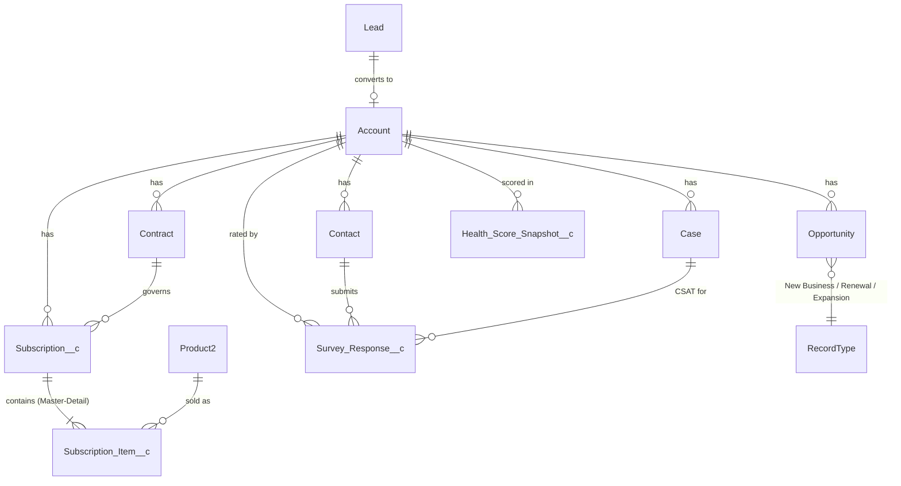
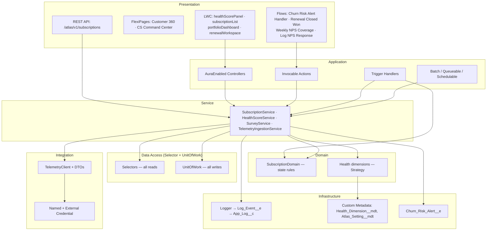
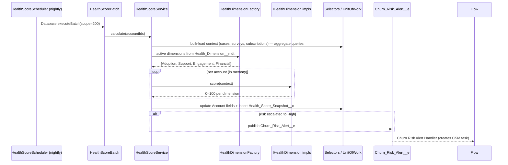
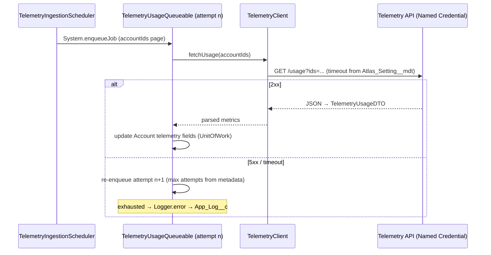
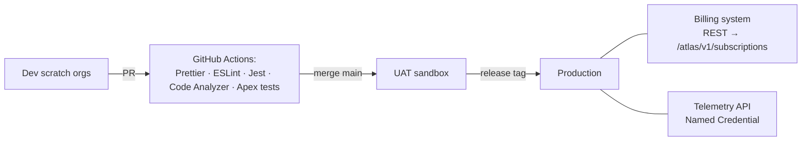

# Atlas Customer Success Cloud — Architecture Specification

This document is the reference architecture for Atlas Customer Success Cloud, a native
Salesforce application that manages the post-sale customer lifecycle: subscription management,
customer health scoring, NPS/CSAT surveys, churn-risk engagement, support routing and the
renewal/expansion pipeline.

It is written for a large-org deployment: private sharing with role-hierarchy visibility, data
access that stays within governor limits as data grows (aggregate queries, batch chunking), and
async processing sized by data volume rather than user count.

---

## 1. Scope and business capabilities

| Capability                              | How it is delivered                                                                                            |
| --------------------------------------- | -------------------------------------------------------------------------------------------------------------- |
| Lead → Account → Opportunity → Contract | Standard Salesforce objects and standard sales processes (no custom parallel pipeline)                         |
| Subscription management                 | `Subscription__c` + `Subscription_Item__c` (junction to `Product2`), synced from the billing system via REST   |
| Customer health scoring                 | Nightly Batch Apex engine, Strategy pattern, weights in Custom Metadata, history in `Health_Score_Snapshot__c` |
| Voice of customer                       | `Survey_Response__c` (NPS/CSAT) with account-level NPS aggregation                                             |
| Churn-risk engagement                   | `Churn_Risk_Alert__e` platform event consumed by an admin-editable flow                                        |
| Support                                 | Standard `Case` with queue-based assignment rules                                                              |
| Renewal / Upsell                        | `Opportunity` record types (`Renewal`, `Expansion`) with a dedicated Business Process                          |
| Product telemetry                       | Scheduled ingestion from the telemetry API via Named Credential + Queueable with retry                         |
| Observability                           | `Log_Event__e` (publish-immediately) persisted to `App_Log__c`                                                 |

Out of scope for v1: CPQ integration, Entitlements/Milestones, Einstein scoring, Experience
Cloud portal.

---

## 2. Domain model



Key modeling decisions (full rationale in the ADRs):

- **`Subscription_Item__c` is Master-Detail to `Subscription__c`** — items have no lifecycle of
  their own, and Master-Detail gives us a native Roll-Up Summary (`Total_ARR__c`) with zero code.
  The `Product2` side is a lookup, making the object a junction between commercial catalog and
  contracted service.
- **`Subscription__c` → `Account` is a lookup, not Master-Detail** — subscriptions must survive
  account merges and support independent sharing (Private OWD with criteria-based sharing).
- **Renewal and Expansion are Opportunity record types** (ADR-0003) — a custom "Renewal" object
  would fork pipeline reporting, forecasting and territory management away from the platform.
- **Health history is a snapshot object, not field history** — trend analysis needs queryable,
  reportable rows with per-dimension values; Field History is capped, not queryable at scale and
  not designed for analytics.
- **`Account` carries the _current_ state** (`Health_Score__c`, `Churn_Risk__c`, `NPS__c`,
  telemetry fields) so list views, reports and sharing criteria work without joins; history lives
  in snapshots.

---

## 3. Layered architecture



Layer contracts:

| Layer                           | May call                                                   | Must never                            |
| ------------------------------- | ---------------------------------------------------------- | ------------------------------------- |
| Triggers                        | its handler only                                           | contain logic, SOQL or DML            |
| Trigger Handlers                | Domain, Services                                           | recurse (guarded), issue DML directly |
| Controllers / REST / Invocables | Services, Selectors                                        | contain business rules                |
| Services                        | Domain, Selectors, UnitOfWork, Integration clients, Logger | reference LWC/trigger context         |
| Domain                          | in-memory records only                                     | query or perform DML                  |
| Selectors                       | SOQL only (`WITH USER_MODE` by default)                    | mutate data                           |
| UnitOfWork                      | DML only                                                   | contain queries or rules              |

**Repository pattern note.** A generic `Repository<T>` on top of SOQL/DML is duplicated
abstraction in Apex. The pattern's intent — isolate persistence behind an interface — is realized
here as **Selector (reads) + UnitOfWork (writes)**, which is the form Salesforce's own Apex
Enterprise Patterns give it (ADR-0002).

---

## 4. Trigger architecture

One trigger per object, zero logic in the trigger body:

```
SubscriptionTrigger (all events)
  └─ SubscriptionTriggerHandler extends AtlasTriggerHandler
       ├─ before: SubscriptionDomain (defaulting, state-transition validation)
       └─ after:  SubscriptionService (renewal opportunity sync)
```

`AtlasTriggerHandler` (base class — app-prefixed precisely because "TriggerHandler" is the
most collided class name in multi-project orgs) provides: event routing, per-object bypass API
(`AtlasTriggerHandler.bypass('SubscriptionTriggerHandler')`) for data migrations, and a static
run-guard against reentrancy. Bypass state is transaction-scoped statics — no custom settings,
no hidden global state.

---

## 5. Health score engine

Requirements: score the active customer base nightly, with a per-dimension breakdown,
admin-tunable weights without a deployment, and full auditability of each run.



- **Strategy + Factory, metadata-driven:** each dimension implements `IHealthDimension`; the
  factory instantiates implementations via `Type.forName` from `Health_Dimension__mdt`
  (class name, weight, active flag). Adding a dimension = one class + one metadata record.
  Re-weighting = metadata change, no deploy.
- **Bulk-safe by construction:** the service loads one `HealthScoreContext` per account from
  aggregate queries _before_ any dimension runs; dimensions are pure functions over the context —
  they cannot query.
- **Why Batch Apex, not Scheduled Flow:** weighted aggregation across four objects and time
  windows needs explicit chunking, aggregate SOQL, and unit tests. Flow has no aggregate query,
  weaker bulkification control, and no isolated unit testing.
- **Why a platform event on risk escalation, not a flow on Account update:** the scoring engine
  must not know what engagement actions exist. The event decouples producer from consumers;
  today's consumer is a flow (admins own the playbook), tomorrow's could be Slack or Marketing
  Cloud — no change to the engine.

---

## 6. Subscription lifecycle and renewal pipeline

- Billing remains the system of record; Salesforce holds the operational copy, keyed by
  `External_Id__c` (unique external ID).
- Inbound sync: `POST /services/apexrest/atlas/v1/subscriptions` — **idempotent upsert** on
  `External_Id__c`. Replaying a message cannot create duplicates (ADR-0006).
- `SubscriptionDomain` enforces the state machine
  `Draft → Active → (Renewed | Churned | Expired)` in `before update`; invalid transitions are
  rejected with `addError` (bulk-safe, no exceptions thrown across the trigger boundary).
- On activation, `SubscriptionService` creates the **Renewal opportunity** (record type
  `Renewal`, close date = renewal date, amount = `Total_ARR__c`). If the renewal date moves, the
  open renewal opportunity is realigned. Event-driven at the source beats a daily "scan
  everything" batch: no scan window to miss, no extra nightly job.

## 7. Telemetry ingestion (outbound integration)



- **Named Credential + External Credential**: no endpoints or secrets in code or metadata;
  per-environment configuration.
- Timeouts, attempt caps, retention and NPS windows live in `Atlas_Setting__mdt` (one
  "Default" record) — tunable per environment without deployment.
- **Retry via chained Queueable** with an attempt counter and metadata-configured cap — the
  platform has no native retry for callouts; chaining is the documented pattern.
- 4xx responses are **not retried** (client errors are deterministic); they are logged and
  surfaced. Only 5xx/timeouts retry.

## 8. Eventing model

| Event                 | Publish behavior     | Producer           | Consumers                   | Justification                                                                      |
| --------------------- | -------------------- | ------------------ | --------------------------- | ---------------------------------------------------------------------------------- |
| `Churn_Risk_Alert__e` | Publish After Commit | HealthScoreService | Flow (CSM task)             | Alerts must only fire if the score actually committed                              |
| `Log_Event__e`        | Publish Immediately  | Logger             | Apex trigger → `App_Log__c` | Error logs must survive transaction rollback — the whole point of logging failures |

## 9. Security architecture

Full detail in [SECURITY.md](SECURITY.md). Summary:

- OWD: `Account` Private, `Subscription__c` Private; `Health_Score_Snapshot__c` and
  `Survey_Response__c` are Master-Detail to Account (Controlled by Parent — visibility follows
  the customer); `App_Log__c` Private (admin-only permission set).
- Access via **Permission Sets and Permission Set Groups only** (`Atlas_CS_Base`, `Atlas_CSM`,
  `Atlas_CS_Manager` PSG, `Atlas_Integration`); profiles grant nothing.
- Apex: Selectors run `WITH USER_MODE`; DML through UnitOfWork defaults to user mode
  (`AccessLevel.USER_MODE`). The deliberate system-mode paths are enumerated in
  [ADR-0005](adr/ADR-0005-user-mode-by-default.md) — one table, each row with the reason that
  path cannot run as the user, kept as the single source of truth so no count drifts here.
- No hardcoded IDs anywhere: record types resolved via `Schema.SObjectType...getRecordTypeInfosByDeveloperName()`,
  queues/groups by DeveloperName query.

## 10. Automation tool selection

| Scenario                                    | Tool                              | Why not the alternatives                                                                                                                                                      |
| ------------------------------------------- | --------------------------------- | ----------------------------------------------------------------------------------------------------------------------------------------------------------------------------- |
| Subscription state rules                    | Apex (Domain)                     | Cross-field state machine with bulk `addError`; flows can't unit-test transitions                                                                                             |
| Renewal opportunity creation                | Apex (Service via trigger)        | Needs record type resolution, UoW, idempotent re-alignment                                                                                                                    |
| Churn engagement playbook                   | **Platform-event-triggered Flow** | Admins own cadence/wording; changes weekly; zero-deploy is the requirement                                                                                                    |
| Nightly scoring                             | Batch + Scheduled Apex            | Aggregates across cases, surveys and subscriptions; chunked and unit-testable                                                                                                 |
| Case routing                                | Assignment Rules + Queue          | Native, declarative, exactly what the feature is for                                                                                                                          |
| Manual score refresh from Flow/quick action | Invocable Apex                    | Exposes the service to declarative tools without duplicating logic                                                                                                            |
| Renewal won → subscription Renewed          | **Record-triggered Flow**         | One keyed cross-object field update with entry conditions; the Apex state machine still validates the transition — nothing to unit-test beyond what the domain already covers |
| NPS coverage sweep                          | **Scheduled Flow**                | Entry criteria are indexed Account fields only (no per-interview queries); cadence and task wording are admin-owned                                                           |
| Off-channel NPS capture                     | **Screen Flow**                   | Thin form over `Survey_Response__c`; validation rules and the survey trigger do the real work                                                                                 |
| Portfolio dashboards                        | LWC + aggregate SOQL (USER_MODE)  | Flat query cost regardless of data volume; sharing decides what each viewer's numbers mean                                                                                    |

Rule of thumb applied: **declarative where admins iterate, Apex where engineers must test.**

## 11. Performance and LDV strategy

- All code paths bulkified; no SOQL/DML in loops (enforced by PMD in CI).
- Aggregate queries (`COUNT`, `AVG` grouped by `AccountId`) instead of loading child rows.
- `External_Id__c` unique+indexed for the API upsert path; snapshot queries always bounded by
  account + date range (`CreatedDate` index).
- `Health_Score_Snapshot__c` is the LDV hot spot (accounts × 365/yr): mitigation is a
  metadata-configured retention window enforced by the nightly batch's finish phase (delete
  snapshots older than N months), documented for Big Objects migration if retention must be long.
- Batch scope 200 keeps per-chunk heap/query budgets comfortable at 4 dimensions × 200 accounts.

## 12. Testing strategy

- `AtlasTestDataFactory` builds valid object graphs; tests never hand-roll records.
- Unit tests per service/domain class; trigger tests operate on 200+ records (bulk proof).
- `HttpCalloutMock` for all callout paths, including 5xx retry and 4xx no-retry branches.
- `Test.getEventBus().deliver()` for platform event subscriber tests.
- Negative tests: invalid state transitions, FLS-restricted user (`System.runAs` with a
  minimum-access user + permission set assignment), API idempotency replay.
- Every test asserts behaviour; assert-free coverage padding is rejected in review. Coverage is
  reported by `sf apex run test --code-coverage` in CI, not asserted as a fixed number here.

## 13. DevOps

- Salesforce DX source format; scratch org definition included.
- GitHub Actions: PR pipeline runs Prettier check → ESLint → LWC Jest → Salesforce Code
  Analyzer (PMD rules for bulkification/security) → scratch-org deploy + Apex tests (when a
  Dev Hub auth secret is configured).
- Releases are cut from Git tags (`v*`); the release workflow validates check-only against
  production before deploying.

---

## Appendix A — Deployment view


